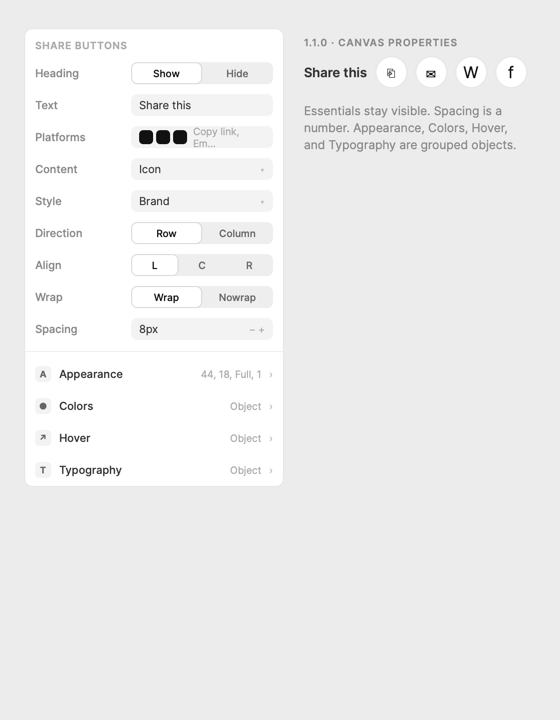
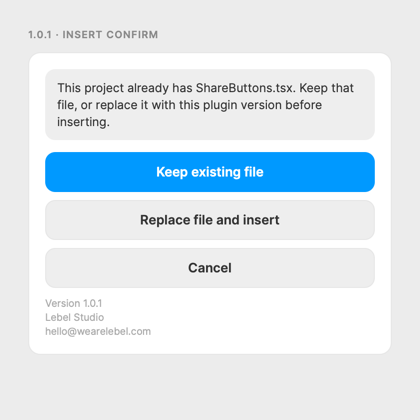
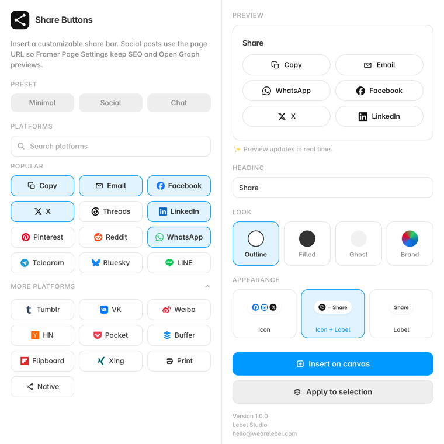
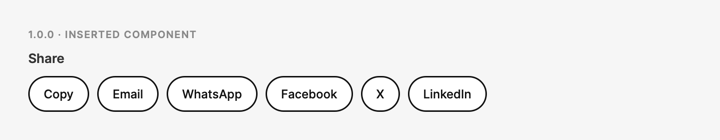

# Changelog

All notable changes to Share Buttons are documented in this file.

The format is based on [Keep a Changelog](https://keepachangelog.com/en/1.1.0/),
and this project adheres to [Semantic Versioning](https://semver.org/spec/v2.0.0.html).

Visual plates for each release live in [`docs/changelog/`](./docs/changelog/). HTML sources are there too if a plate needs to be re-rendered. Marketplace paste lives in [MARKETPLACE.md](./MARKETPLACE.md).

## [Unreleased]

## [1.1.0] - 2026-09-02

Property panel reorganization after Framer review feedback.

### Changed

- Essentials stay visible: heading, platforms, content, style, direction, align, wrap.
- Spacing is a top-level control. Appearance, colors, hover, and typography are grouped objects.
- Appearance uses Framer’s radius control so pills can be Full instead of 999px.
- Plugin labels match the canvas panel (Content, Style).

## [1.0.1] - 2026-08-31

Marketplace follow-up after Framer’s silent-overwrite review. Plugin id `b4c9e1`.

### Security

- Insert asks before replacing an existing `ShareButtons.tsx` (Keep existing / Replace file and insert / Cancel).

### Added

- Plugin menu and footer show version, Lebel Studio, and support email.

### Fixed

- Copy-status timer cleanup and page URL / canonical handling for share targets.

## [1.0.0] - 2026-08-30

First marketplace release. The plugin inserts a code component onto the canvas.

### Added

- Canvas plugin that writes `ShareButtons.tsx` and places an instance.
- 22 platforms: Copy, Email, Facebook, X, Threads, Bluesky, LinkedIn, Pinterest, Reddit, WhatsApp, Telegram, LINE, Tumblr, VK, Weibo, Hacker News, Pocket, Buffer, Flipboard, Xing, Print, and Native share.
- Looks (Outline, Filled, Ghost, Brand) and appearance (Icon, Icon + label, Label).
- Presets Minimal / Social / Chat, live preview, and Apply to selection.
- Shares use the current page URL so Framer Page Settings and Open Graph stay in charge.
- Print builds a clean article sheet instead of dumping page chrome.
